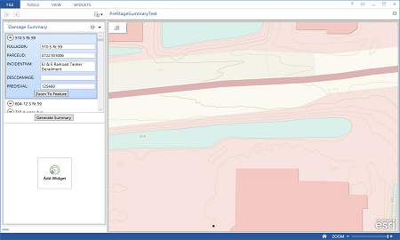

damage-assessment-summary
=========================

The Damage Assessment Summary Add-in extends the Operations Dashboard for ArcGIS application and allows you to generate a damage summary

## Features

* Review damage assessment features and attributes
* Generate summary report

## Instructions

[Download](http://links.esri.com/emergencymanagement/download/DamageAssessment)

[Help](http://links.esri.com/emergencymanagement/help/10.2/DamageAssessment).

### General Help
[New to Github? Get started here.](http://htmlpreview.github.com/?https://github.com/Esri/esri.github.com/blob/master/help/esri-getting-to-know-github.html)

## Requirements

## Resources

Show me a list of other [State Government GitHub repositories](http://esri.github.io/#State-Government).

Show me a list of other [Emergency Management GitHub repositories](http://esri.github.io/#Emergency-Management).

This application uses the 10.2.5 version of
[Esri's ArcGIS Runtime SDK for WPF](http://resources.arcgis.com/en/communities/runtime-wpf/);
see the site for concepts, samples, and API reference.

## Issues

Find a bug or want to request a new feature?  Please let us know by submitting an issue.

## Contributing

Esri welcomes contributions from anyone and everyone.
Please see our [guidelines for contributing](https://github.com/esri/contributing).

## Licensing

Copyright 2015 Esri

Licensed under the Apache License, Version 2.0 (the "License");
you may not use this file except in compliance with the License.
You may obtain a copy of the License at

   http://www.apache.org/licenses/LICENSE-2.0

Unless required by applicable law or agreed to in writing, software
distributed under the License is distributed on an "AS IS" BASIS,
WITHOUT WARRANTIES OR CONDITIONS OF ANY KIND, either express or implied.
See the License for the specific language governing permissions and
limitations under the License.

A copy of the license is available in the repository's
[LICENSE.txt](LICENSE.txt) file.

